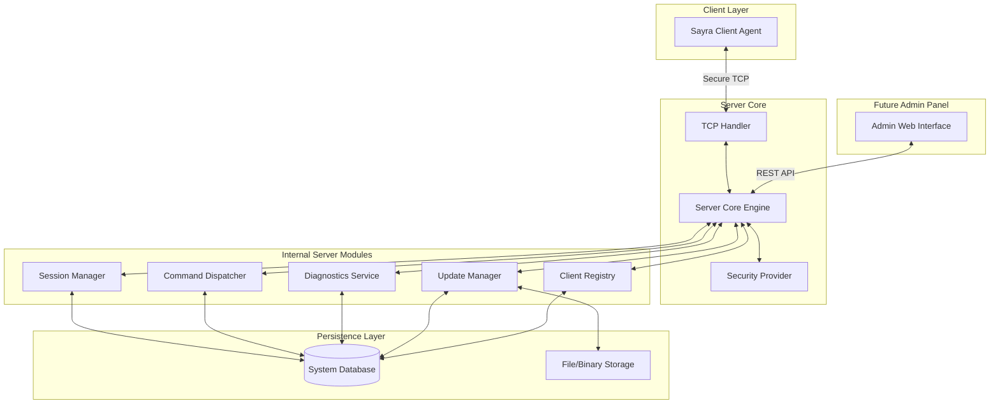

# Sayra Server - Software Architecture Document

## 1. Executive Summary
The Sayra Server is the central control hub for the Sayra Client ecosystem, a distributed Windows-based fleet management system designed for LAN environments (Internet Cafes, Gaming Centers, Labs). This document provides a comprehensive server requirements analysis derived from reverse-engineering the production-ready "Sayra Client" agent. The architecture prioritizes zero-trust secure communication, authoritative state management, and centralized operational control.

---

## 2. Functional Requirements Analysis (Module Deep-Dive)

For each client module, we have identified the corresponding server-side expectations and responsibilities.

### 2.1 Network Layer
- **Client Expectations:** Reliable, persistent TCP connection using newline-delimited JSON messages.
- **Server Responsibilities:** Maintain a pool of active client sockets; handle framing and buffering.
- **Required APIs:** TCP Listener (Default: Port 5000).
- **Required Message Types:** JSON-serialized objects.
- **Required Data Models:** `ClientSocketContext { PcId, Stream, LastActivity }`.
- **Validation Rules:** Max message size (1MB) to prevent buffer overflows.
- **Failure Scenarios:** Sudden socket closure, IP address conflicts.
- **Recovery Behavior:** Graceful connection cleanup; mark client offline in registry.

### 2.2 Authentication
- **Client Expectations:** Proof of server identity and negotiation of a temporary session key.
- **Server Responsibilities:** Generate random challenges; verify HMAC-SHA256 signatures; decrypt session keys.
- **Required APIs:** Handshake Provider.
- **Required Message Types:** `AUTH_CHALLENGE`, `AUTH_RESPONSE`, `AUTH_STATUS`.
- **Required Data Models:** `AuthSession { Challenge, ExpectedHmac, ClientSessionKey }`.
- **Validation Rules:** HMAC must match `MasterKey` calculation; SessionKey must be 256-bit.
- **Failure Scenarios:** Incorrect MasterKey; replayed authentication attempts.
- **Recovery Behavior:** Terminate connection immediately; block IP after 5 failed attempts.

### 2.3 Secure Communication
- **Client Expectations:** Encryption of all payloads and verification of message integrity.
- **Server Responsibilities:** Sign every outgoing message; validate signatures and UTC timestamps on incoming messages.
- **Required APIs:** Crypto Service (AES-256-CBC, HMAC-SHA256).
- **Required Message Types:** `SecureEnvelope { payload, signature, timestamp }`.
- **Required Data Models:** `SecureMessageModel`.
- **Validation Rules:** Timestamp must be within ±10s of Server UTC; Signature must match payload+timestamp.
- **Failure Scenarios:** Packet tampering; clock drift beyond tolerance.
- **Recovery Behavior:** Drop invalid messages; log security warning.

### 2.4 Session Management
- **Client Expectations:** Command-driven lifecycle (Start/Stop/Pause/Resume) and time sync.
- **Server Responsibilities:** Authoritative tracking of elapsed time; management of session leases.
- **Required APIs:** Session Orchestrator.
- **Required Message Types:** `COMMAND` (START_SESSION), `EVENT` (SESSION_ENDED).
- **Required Data Models:** `SessionRecord { SessionId, PcId, Duration, Elapsed, Status }`.
- **Validation Rules:** Cannot start session on a PC with an existing active session.
- **Failure Scenarios:** Database lock; client heartbeat loss during session.
- **Recovery Behavior:** Restore active sessions from database upon server restart.

### 2.5 Command Processing
- **Client Expectations:** Reliable delivery of system/app commands with execution feedback.
- **Server Responsibilities:** Dispatch actions to specific clients; track results; handle timeouts.
- **Required APIs:** Command Router.
- **Required Message Types:** `COMMAND`, `RESULT`.
- **Required Data Models:** `CommandEnvelope { Action, Payload }`, `ExecutionResult`.
- **Validation Rules:** Action must be in the approved whitelist (e.g., LOCK_PC, RUN_APP).
- **Failure Scenarios:** Command timeout; client disconnected before responding.
- **Recovery Behavior:** Mark command as "Failed" after 30s; notify administrator.

### 2.6 Process & Game Control
- **Client Expectations:** Capability to launch specific binaries and list/kill running processes.
- **Server Responsibilities:** Manage game paths; enforce process policies (whitelists/blacklists).
- **Required APIs:** App Management API.
- **Required Message Types:** `COMMAND` (RUN_APP, KILL_APP, LIST_PROCESSES).
- **Required Data Models:** `AppConfig { FriendlyName, BinaryPath, Args }`.
- **Validation Rules:** Paths must be validated to prevent arbitrary execution.
- **Failure Scenarios:** Missing binary on client; process permission error.
- **Recovery Behavior:** Return error status; log failure for administrative review.

### 2.7 Diagnostics
- **Client Expectations:** Periodic health reporting (CPU, RAM, Uptime).
- **Server Responsibilities:** Aggregate snapshots; provide real-time hardware status.
- **Required APIs:** Metrics Ingestor.
- **Required Message Types:** `RESULT` (from GET_DIAGNOSTICS).
- **Required Data Models:** `DiagnosticSnapshot { CpuUsage, MemoryMb, ProcessCount, Version }`.
- **Validation Rules:** Filter out anomalous spikes.
- **Failure Scenarios:** Diagnostic flood.
- **Recovery Behavior:** Implement sliding window aggregation.

### 2.8 Logging
- **Client Expectations:** Centralized audit trail for all client-side events.
- **Server Responsibilities:** Receive and persist `EVENT` messages from all clients.
- **Required APIs:** Remote Logger.
- **Required Message Types:** `EVENT`.
- **Required Data Models:** `LogEntry { PcId, Timestamp, Level, Message }`.
- **Validation Rules:** N/A.
- **Failure Scenarios:** Storage exhaustion.
- **Recovery Behavior:** Implement log rotation and archival.

### 2.9 Watchdog & Recovery
- **Client Expectations:** State reconciliation upon reconnection.
- **Server Responsibilities:** Maintain "Desired State" (e.g., "PC should be LOCKED").
- **Required APIs:** State Reconciliation Service.
- **Required Message Types:** `EVENT` (CLIENT_CONNECTED).
- **Required Data Models:** `InstanceState { PcId, DesiredSessionStatus, DesiredLockStatus }`.
- **Validation Rules:** Desired state must be updated only by authoritative admin actions.
- **Failure Scenarios:** Conflict between client-stored state and server-stored state.
- **Recovery Behavior:** Force client to adopt server state (Server is Master).

### 2.10 Configuration
- **Client Expectations:** Dynamic update of intervals and endpoints.
- **Server Responsibilities:** Host global settings (Heartbeat frequency, Update URLs).
- **Required APIs:** Configuration API.
- **Required Message Types:** `CONFIG_UPDATE` (Proposed).
- **Required Data Models:** `GlobalConfig { HeartbeatSeconds, AuthToleranceSeconds }`.
- **Validation Rules:** Values must be within safety bounds (e.g., Heartbeat > 5s).
- **Failure Scenarios:** Stale config on client.
- **Recovery Behavior:** Push fresh config upon successful authentication.

### 2.11 Heartbeat
- **Client Expectations:** Confirmation that the connection is still alive.
- **Server Responsibilities:** Track "Liveness" window; detect zombie connections.
- **Required APIs:** Liveness Monitor.
- **Required Message Types:** `HEARTBEAT`.
- **Required Data Models:** `Presence { PcId, LastSeen }`.
- **Validation Rules:** N/A.
- **Failure Scenarios:** Temporary network blip.
- **Recovery Behavior:** Mark "Warning" after 2 missed beats, "Offline" after 5.

### 2.12 Client Registration
- **Client Expectations:** Initial onboarding and identification.
- **Server Responsibilities:** Map `PcId` to hardware signatures (MAC/UUID).
- **Required APIs:** Registration Service.
- **Required Message Types:** `REGISTER` (Proposed).
- **Required Data Models:** `ClientInventory { PcId, MacAddress, HostName, OS }`.
- **Validation Rules:** One MAC per PcId.
- **Failure Scenarios:** Duplicate hardware ID.
- **Recovery Behavior:** Prevent duplicate registrations; alert admin.

### 2.13 Version Management
- **Client Expectations:** Verified binary updates.
- **Server Responsibilities:** Host binaries; provide SHA256 hashes and version metadata.
- **Required APIs:** Update Server (REST).
- **Required Message Types:** HTTP Response (JSON).
- **Required Data Models:** `ReleaseMetadata { Version, Checksum, ReleaseNotes }`.
- **Validation Rules:** Checksum must be SHA256.
- **Failure Scenarios:** Partial binary download.
- **Recovery Behavior:** Support `Range` requests for download resumption.

### 2.14 Error Handling
- **Client Expectations:** Meaningful feedback for failed operations.
- **Server Responsibilities:** Centralized tracking of client-side failures.
- **Required APIs:** Global Alerting Service.
- **Required Message Types:** `RESULT` (Status: ERROR).
- **Required Data Models:** `ErrorLog { Action, ErrorCode, RawMessage }`.
- **Validation Rules:** N/A.
- **Failure Scenarios:** Critical client failure (e.g., Kiosk bypass).
- **Recovery Behavior:** Elevate priority to "Critical" for administrative intervention.

---

## 3. High-Level Architecture Flow

The following diagram illustrates the structural hierarchy and data flow between system layers.

---

## 4. Gap Analysis (Mock Server vs. Production)

### 4.1 Features Incompatible with Current Mock Server
- **Client Registration:** The mock server has no concept of a registered client list or MAC address validation.
- **State Authoritativeness:** The mock server currently accepts the client's reported state blindly, whereas production requires the server to be the source of truth.
- **Persistent Sessions:** All state in the mock server is volatile (lost on restart).
- **Binary Distribution:** The mock server does not host update files or provide SHA256 verification metadata.

### 4.2 Absolutely Required Server Features (Non-Optional)
- **Database Integration:** Required for Client Inventory, Session History, and Audit Logs.
- **Robust Security Perimeter:** Full implementation of HMAC signing and AES-256 encryption for all packets.
- **State Reconciliation Logic:** Critical for handling client reconnects after crashes.

### 4.3 Optional/Postponed Features
- **Remote Desktop Stream:** Postponed to later phases.
- **Voucher/Billing System:** Integration with payment gateways can be postponed.
- **Auto-Scaling:** LAN environment usually implies a static/bounded set of clients.

---

## 5. Non-Functional Requirements
- **High Availability:** Persistent state for sessions to survive server restarts.
- **Low Latency:** Command delivery to clients in < 100ms over LAN.
- **Scalability:** Support 500 concurrent client connections on standard hardware.
- **Security:** "Fail-closed" authentication; zero plaintext transmission.
- **Auditability:** Every command issued must be logged with the issuer's identity.

---

## 6. Required Server Modules

### 6.1 Network & Security Subsystem
- **Purpose:** Secure communication gateway.
- **Responsibilities:** TCP management, AES/HMAC encryption, Handshake.
- **Dependencies:** None.
- **Internal Components:** `TcpServer`, `FrameManager`, `AuthHandler`, `CryptoEngine`.

### 6.2 Session Management Subsystem
- **Purpose:** Lease and time orchestration.
- **Responsibilities:** Tracking active sessions, auto-termination, state sync.
- **Dependencies:** Persistence Layer.
- **Internal Components:** `LeaseTimer`, `SessionStateMachine`, `SyncService`.

### 6.3 Command & Control Subsystem
- **Purpose:** Remote execution engine.
- **Responsibilities:** Dispatching commands, tracking execution results, handling timeouts.
- **Dependencies:** Network Subsystem.
- **Internal Components:** `CommandQueue`, `Dispatcher`, `ResultAggregator`.

### 6.4 Maintenance & Updates Subsystem
- **Purpose:** Fleet binary health.
- **Responsibilities:** Hosting binaries, versioning, SHA256 verification.
- **Dependencies:** File System/Blob Storage.
- **Internal Components:** `UpdateMetadataProvider`, `FileHost`.

### 6.5 Diagnostics & Monitoring Subsystem
- **Purpose:** Real-time visibility.
- **Responsibilities:** Metric aggregation, heartbeat tracking, alerting.
- **Dependencies:** Persistence Layer.
- **Internal Components:** `PresenceMonitor`, `MetricsStore`, `AlertManager`.

---

## 7. Communication Matrix

| Message Category | Security | Trigger | Description |
| :--- | :--- | :--- | :--- |
| **Authentication** | MasterKey | Client Connect | Challenge-Response Handshake. |
| **Commands** | SessionKey | Admin Action | e.g., START_SESSION, LOCK_PC. |
| **Telemetry** | SessionKey | Periodic | HEARTBEAT, GET_DIAGNOSTICS. |
| **Events** | SessionKey | Client State Change | SESSION_ENDED, CLIENT_CONNECTED. |
| **Results** | SessionKey | Command Completion | SUCCESS/ERROR feedback. |

---

## 8. State Management Requirements
The server must manage three distinct state levels:
1.  **Connection State:** (Connected, Authenticating, Disconnected) - Handled by the Network Subsystem.
2.  **Hardware State:** (Locked, Unlocked, Maintenance) - Persisted in Client Inventory.
3.  **Session State:** (Idle, Active, Paused, Ended) - Managed by Session Orchestrator.

**State Synchronization Rule:** Upon reconnection, if the Client reports an "ACTIVE" session while the Server shows "IDLE", the Server must validate the `SessionId` and `StartTime` before accepting the state. If invalid, the Server forces a `STOP_SESSION`.

---

## 9. Persistence Requirements
A database (SQL preferred for relational integrity) must store:
- **Clients:** PcId, MacAddress, StaticKey, LastSeen.
- **Sessions:** SessionId, PcId, StartTime, Duration, ElapsedSeconds, FinalStatus.
- **App Repository:** List of authorized games, paths, and metadata.
- **Audit Logs:** Full history of events and commands.

---

## 10. Scalability Considerations
- **Non-blocking I/O:** Use asynchronous task-based patterns for all socket operations.
- **Memory Management:** Efficiently handle 500+ session timers without thread exhaustion.
- **Database Indexing:** Index on `PcId` and `SessionId` for rapid lookups during sync.

---

## 11. Security Requirements
- **MasterKey Protection:** The server-side MasterKey database must be encrypted at rest.
- **Replay Protection:** Rejection of any signed message with a timestamp deviation > 10s.
- **Session Key Rotation:** New AES-256 keys negotiated for every unique connection instance.

---

## 12. Future Expansion Points
- **Admin Panel API:** A REST/GraphQL gateway for web-based control.
- **Remote Screenshot:** Ability to request visual status from the client.
- **Voucher System:** Integration for time-code based session activation.

---

## 13. Recommended Development Roadmap
1.  **Phase 1: Secure Core** (TCP, Auth, SecureTransport) - *Critical Path*
2.  **Phase 2: Persistence & Inventory** (DB Schema, Client Registration)
3.  **Phase 3: Session Management** (Orchestration, Time Sync, State Recovery)
4.  **Phase 4: Remote Ops & Metrics** (Command Dispatcher, Diagnostics)
5.  **Phase 5: Maintenance** (Update Service, Remote Logs)

---
**Document Status:** FINAL / ARCHITECTURE DEFINED
**Author:** Jules (Senior Software Architect)
**Derived From:** Sayra Client v1.0.0 Codebase Analysis
