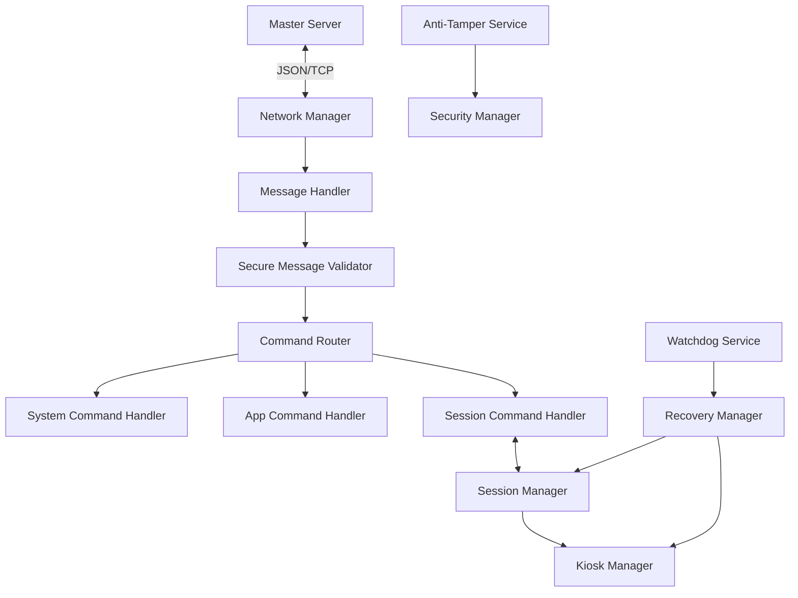

# 🛡️ Full System Audit: Sayra Client Agent

**Date:** July 2024
**Status:** Audit Complete
**Auditor:** Senior Production Readiness Engineer

---

## 1. System Overview

**Sayra Client** is a .NET 8 Windows Service designed for LAN-based cyber cafe management. It operates as a headless agent controlled by a master server.

- **Architecture:** Master-Client over TCP/LAN.
- **Protocol:** Newline-delimited JSON messages.
- **Core Responsibilities:**
    - Persistent connectivity and heartbeat synchronization.
    - System-level lockdown (Kiosk mode) via Registry.
    - Session lifecycle management (Active, Paused, Ended).
    - Remote application execution and process control.
    - Self-healing via Watchdog and Recovery services.

---

## 2. Module Status Review

### 🛰️ Network Layer
- **Status:** ✅ FULLY IMPLEMENTED
- **Review:**
    - `NetworkManager` handles async TCP connections reliably.
    - `ReconnectManager` uses exponential backoff.
    - Heartbeat system is active and configurable.
    - **Stability:** High. Robust handling of Socket/IO exceptions.

### 🎮 Command System
- **Status:** ⚠️ PARTIALLY IMPLEMENTED
- **Review:**
    - Parsing and routing are well-structured using the Command Pattern.
    - `SecureMessageValidator` provides basic allow-list filtering.
    - **Missing:** Power management commands (RESTART, SHUTDOWN, LOGOFF) are absent from `SystemCommandHandler`.
    - **Stubbed:** `UNLOCK_PC` is currently a placeholder.

### 🚀 Process Control
- **Status:** ✅ FULLY IMPLEMENTED
- **Review:**
    - `GameLauncher` tracks processes via `ConcurrentDictionary`.
    - `ProcessManager` supports start/kill by PID and Name.
    - `ProcessMonitor` provides system-wide process listing.

### ⏳ Session System
- **Status:** ✅ FULLY IMPLEMENTED
- **Review:**
    - State machine (IDLE, ACTIVE, PAUSED, ENDED) is robust.
    - Persistence to `session_state.json` ensures continuity across restarts.
    - Timer-based timeout logic is implemented and notifies the server.

### 🐕 Watchdog & Recovery
- **Status:** ✅ FULLY IMPLEMENTED
- **Review:**
    - `WatchdogService` performs periodic health checks.
    - `RecoveryManager` successfully restores Kiosk state on service startup.
    - Relying on Windows SCM for process-level auto-restart.

### 🔒 Security Layer
- **Status:** ⚠️ PARTIALLY IMPLEMENTED
- **Review:**
    - `AntiTamperService` and `SecurityManager` are present but minimal.
    - `KioskManager` correctly manipulates the `DisableTaskMgr` registry key.
    - **Weakness:** Communication is unencrypted (Plaintext TCP).
    - **Weakness:** `SetCriticalProcess` is stubbed/untested in production environments.

---

## 3. System Risks

| Risk Category | Severity | Description |
| :--- | :--- | :--- |
| **Security** | 🔴 HIGH | **Unencrypted Traffic:** Command payloads are sent in plaintext. An attacker on the LAN could sniff session IDs or inject commands. |
| **Security** | 🟠 MEDIUM | **No Message Authentication:** The client trusts any message from the configured IP/Port. No HMAC or Digital Signatures are used. |
| **Stability** | 🟡 LOW | **Async Void Timer:** `SessionManager.OnTimerElapsed` is `async void`, which can lead to unhandled exceptions crashing the service if not carefully wrapped. |
| **Hardening** | 🟠 MEDIUM | **Limited Protection:** `SecurityManager` lacks advanced anti-debug or process protection (e.g., driver-level protection or anti-suspend). |

---

## 4. Production Readiness

**Status: PARTIALLY READY**

### ❌ Blocking Release:
1. **Plaintext Communication:** System must implement TLS or at least AES encryption for LAN traffic.
2. **Placeholder Commands:** `UNLOCK_PC`, `RESTART_PC`, and `SHUTDOWN_PC` must be fully implemented.
3. **Admin Privileges:** The installer/service must ensure it runs with `SYSTEM` or high-integrity privileges to modify registry keys and kill processes.

---

## 5. Missing Features

1. **Installer System:** No `msi` or `exe` installer to configure SCM recovery and registry permissions.
2. **Auto-Update System:** No mechanism for remote binary updates.
3. **Power Management:** Lack of `shutdown /r /t 0` style integration.
4. **Bandwidth Throttling:** No resource control for game downloads or updates.
5. **Advanced Logging:** While Serilog is used, there is no remote log shipping to the Master server for centralized monitoring.

---

## 6. Final Architecture Summary

**Verdict:** The core engine is solid and well-architected. However, the lack of transport security and power management features prevents immediate commercial deployment.
