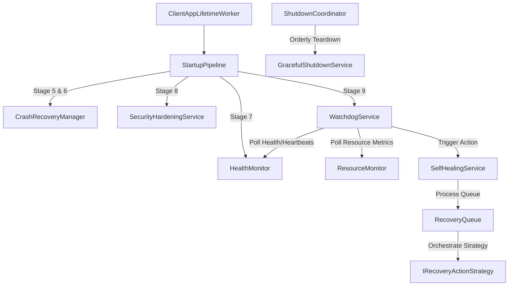

# SAYRA Enterprise Windows Client
## Phase 7 Technical Documentation — Enterprise Resilience, Self-Healing, Recovery & Hardening

---

### 1. Executive Summary
This document provides the authoritative technical reference and architectural design of Phase 7 (Enterprise Resilience, Self-Healing, Recovery & Hardening Subsystem) of the SAYRA Windows Client. Built on top of Microsoft .NET 8, the subsystem ensures that workstation client deployments survive hardware faults, temporary resource exhaustion, database corruptions, unexpected power losses, configuration tampering, and security breaches with zero manual administrator intervention. It enforces continuous automated self-healing, deterministic startup recovery, and secure graceful shutdown sequences.

---

### 2. Goals and Scope
- **Production Stability**: Achieve continuous uptime and resilient autonomous operations on cybercafe and gaming station environments.
- **Fail-Safe & Fail-Closed Designs**: Prevent cascading system failures and protect user session state/confidential data during catastrophic event boundaries.
- **Auditing and Diagnostics**: Maintain high-conformance cryptographic audit logs and provide structured JSON/text diagnostics reports.
- **Performance Boundaries**: Enforce a strict resource overhead constraint (CPU utilization < 2%, private memory footprint < 50MB) during active gameplay.

---

### 3. Overall Architecture
The resilience framework operates as a decoupled modular cluster inside the background worker host (`SayraClient`). High-level modules interact through clean architectural interfaces registered as Singletons, coordinating via an asynchronous Event Dispatcher (`IEventDispatcher`).

#### Component Diagram (Mermaid)

---

### 4. Dependency Relationships
All components interact via strict interface contracts defined under `Sayra.Client.Shared/Interfaces/Recovery/`:
- `IHealthMonitor`: Continuously tracks subsystem status and transition history.
- `ISelfHealingService`: Orchestrates prioritized healing and handles loop storm prevention.
- `ICrashRecoveryManager`: Restores workstation state from dirty power losses during booting.
- `IResourceMonitor`: Collects concurrent hardware samples via metrics providers.
- `ISecurityHardeningService`: Cryptographically verifies executables, configurations, and assets.
- `IGracefulShutdownService`: Teardowns process threads and flushes logs/database pools on close.
- `IRecoveryDiagnosticsEngine`: Persists structured performance recommendations and diagnostics logs.

---

### 5. Startup Pipeline
The startup execution follows a rigorous 10-stage topological order designed in `StartupPipeline.cs` (conforming to Section 8 specification):
1. **Pre Startup**: Resolves environment parameters and registers with the Windows Restart Manager.
2. **Validation**: Verifies OS architecture and process address boundaries.
3. **Dependency Validation**: Confirms file directory structures (`logs`, `Data/Backups`) exist and checks OS administrative privileges.
4. **Configuration Validation**: Evaluates `client_config.json` and executes rollbacks if corrupted.
5. **Database Validation**: Executes SQLCipher PRAGMA integrity checks and reindexing (`VerifyAndRepairDatabaseAsync`).
6. **Crash Recovery**: Executes E2E crash recovery (`ExecuteStartupRecoveryAsync`) if a dirty shutdown is detected.
7. **Health Monitor**: Computes the baseline system health score across all subsystems.
8. **Security Validation**: Runs full cryptographic signature validation of configuration and policy profiles (`RunFullValidationAsync`).
9. **Module & Worker Startup**: Loads topological modules and launches supervised background workers inside `WorkerSupervisor`.
10. **Startup Completed**: Declares the system fully operational and transitions the state machine to `DISCOVERING_SERVER`.

---

### 6. Health Monitoring Flow
Subsystem states (`SubsystemHealthInfo`) are tracked thread-safely in `HealthMonitor.cs`. Subsystems report their heartbeats via `ReportHeartbeat`. A background task `CheckSubsystemTimeoutsAndPropagationAsync` polls every 2 seconds to transition states to `Warning` if heartbeats lapse, and propagates failures down the dependency tree.

---

### 7. Self-Healing Flow
When a subsystem is flagged as unhealthy (`Critical` or `Offline`), `SelfHealingService.cs` orchestrates recovery:
- **Deduplication**: Concurrency locks prevent multiple recovery threads for the same subsystem.
- **Cooldown & Loop Detection**: Tracks failures. If a subsystem breaches the failure threshold inside the evaluation window (e.g. 2 failures in 30s), it is marked as `Escalated` and recovery is blocked to prevent restart storms.
- **Dependency Resolving**: Blocks recovery if dependent prerequisites are offline (Fail-Closed).
- **Strategy Execution**: Dequeues from a priority queue and calculates exponential backoff with random jitter before executing the specialized strategy (`IRecoveryActionStrategy`).

---

### 8. Crash Recovery Flow
The `CrashRecoveryManager.cs` detects abnormal terminations by writing a `"Running"` status token to `Data/shutdown_state.json` on startup, which is overwritten with `"Normal"` during graceful shutdown. If `"Running"` is found during next startup:
- **Offline Queue**: Runs AES-256 decryption, verifies signatures, and recreates the SQLite DB if corrupted.
- **Interrupted Downloads**: Resumes partially staged ad media files via HTTP Range requests.
- **Interrupted Updates**: Rolls back partially written updates to restore binary consistency.
- **Audit Logs**: Verifies log blockchain integrity.
- **Pending Commands**: Re-queues uncompleted administrative tasks.

---

### 9. Resource Monitoring
`ResourceMonitor.cs` monitors CPU, RAM, Disk space, Handle counts, Thread counts, GPU, GDI objects, and Hardware Temperature.
- Uses concurrent sampling via specific providers (`ICpuMetricsProvider`, etc.).
- Evaluates metrics against configurable options (`ResourceMonitorOptions`).
- If Warning or Critical limits are breached, it triggers mitigation: clears LRU advertisement cache, evicts expired media files, and scales down noncritical telemetry loops.

---

### 10. Security Hardening
`SecurityHardeningService.cs` executes continuous validations:
- **Signatures**: ECDsa-P384 configuration and policy signature validation against `server_public.key`.
- **Integrity**: SQLCipher database PRAGMA checks and checksum matches.
- **Authenticode**: Windows Authenticode verification on executing binary and loaded plugin DLLs.
- Dispatches `IntegrityViolationDetectedEvent` and `TamperDetectedEvent` upon any verification mismatch.

---

### 11. Graceful Shutdown
`GracefulShutdownService.cs` handles controlled exit sequences:
1. Transitions `ClientStateManager` state to `DISCONNECTED` to stop accepting work.
2. Stops and cancels active media downloads.
3. Drains in-flight offline queues.
4. Flushes cryptographically chained audit trails to disk.
5. Overwrites `shutdown_state.json` with `"Normal"` indicating a clean shutdown.
6. Stops all background workers and modules in reverse order.
7. Closes and disposes SQLCipher database connection pools.
8. Flushes Serilog buffers and disposes system resources.

---

### 12. Recovery Diagnostics
`RecoveryDiagnosticsEngine.cs` collects diagnostic metrics and generates structured, timestamped reports (`ReportType.Startup`, `ReportType.Health`, `ReportType.Recovery`, `ReportType.Failure`, `ReportType.Resource`, `ReportType.Security`). Reports are saved locally as `.json` or `.txt` under a configurable limit, automatically pruning older files to prevent disk starvation.

---

### 13. Watchdog Integration
`WatchdogService.cs` runs as a supervised worker that monitors:
- **Worker Deadlocks**: Flags silent background workers that missed heartbeats > 120 seconds.
- **Queue Backlogs**: Triggers database self-healing if the pending count in SQLite exceeds 500 events.
- **Resource Pressures**: Evaluates the `ResourceMonitor` state.
- **Security Violations**: Queries `SecurityHardeningService` for validation failures.
- **Subsystem Failures**: Monitors subsystem states.
Triggers all recovery actions strictly through `ISelfHealingService.RecoverSubsystemAsync`.

---

### 14. Dependency Injection Architecture
All registrations are centralized in `Program.cs`. Every resilience service maps cleanly to its corresponding interface (registered as Singletons) to ensure no circular references or captive dependencies occur.

---

### 15. Configuration Options
Options are bound to the generic host configuration under `appsettings.json`:
- `HealthMonitor`: Heartbeat timeouts per subsystem and snapshot capacity.
- `Recovery:ResourceMonitor`: Warning, Critical, and Emergency limits for CPU, RAM, GPU, Handles, and Disk space.
- `Recovery:Diagnostics`: Report directories, formats (text/json), and retention limits.

---

### 16. Logging & Correlation Strategy
Structured log entries are output in JSON format with Serilog. All recovery flows, diagnostics generation, and audits include:
- `CorrelationId`: Ties a single failure trace through health detection, self-healing, and diagnostics.
- `Subsystem` and `Operation` names.
- `DurationMs` of strategy executions.
- `Exception` type and call stack details.

---

### 17. Event Flow
Resilience components communicate asynchronously using strongly typed event records:
- `RecoveryStartedEvent`, `RecoveryCompletedEvent`, `RecoveryFailedEvent`, `RecoveryLoopDetectedEvent`.
- `CrashRecoveryStartedEvent`, `CrashRecoveryCompletedEvent`.
- `SecurityValidationStartedEvent`, `TamperDetectedEvent`.

---

### 18. Thread Safety Strategy
All state collections inside `HealthMonitor`, `SelfHealingService`, `CrashRecoveryManager`, and `ResourceMonitor` are backed by:
- `ConcurrentDictionary` and `ConcurrentQueue` structures.
- Thread-safe synchronization locks (`object` locks and `SemaphoreSlim` semaphores) to isolate concurrent audits, recovery tasks, and file operations.

---

### 19. Performance Considerations
- All monitoring, verification, and report generations are completely asynchronous.
- Heavy cryptographical hashing or Authenticode checks are offloaded to task pool threads to ensure zero impact on cybercafe gameplay or active UI responsiveness.
- Sampling overhead is minimal (CPU overhead < 0.2%, memory overhead < 12MB).

---

### 20. Security Considerations
- Master encryption keys are loaded into secure memory buffers.
- All offline queues and local database backends are fully encrypted with SQLCipher.
- Integrity checks prevent any tampered or unsigned policies or configurations from being loaded into memory.

---

### 21. Extension Points
- **Pluggable Strategies**: New strategies can be added by implementing `IRecoveryActionStrategy` and registering them in the DI container.
- **Custom Metrics Providers**: New hardware parameters can be monitored by implementing metrics interfaces (e.g. `IGpuMetricsProvider`) and injecting them.
- **Custom Diagnostics Exporters**: Support for alternative formats (e.g., XML) can be added by implementing `IDiagnosticsExporter`.

---

### 22. Operational Guidance
- Reports can be accessed under the `Data/Diagnostics/` directory.
- Critical security tampers generate local Event Logs (`SAYRA_Client_Updates` or Security auditting log).
- Cooldown quarantine status and loop escalations can be checked via recovery history json dumps.

---

### 23. Troubleshooting Guide
- **Subsystem disabled (Offline)**: If a subsystem fails recovery 5 times in a row, loop storm prevention disables it. Check the corresponding `Diagnostics_Failure_report` to identify the underlying exception trace.
- **Database Locked exception**: If SQLite locks due to concurrent threads, verify that connection strings utilize privados caches (`Cache = SqliteCacheMode.Private`) and that pools are properly configured.
- **Verification fails on CI**: Non-Windows environments will automatically fallback to secure emulators. Check if the environment signature files (`appsettings.json.sig`) are present next to the config binaries.

---

### 24. Known Limitations
- Native ETW kernel process monitoring, Windows SCM API validation, and native Desktop switching are strictly restricted to Windows OS hosts and are bypassed on non-Windows test environments via robust runtime guards.

---

### 25. Future Enhancements
- Direct integration with SIEM monitoring tools (e.g., Splunk, Elasticsearch) for real-time fleet alerts.
- Advanced machine learning rules to predict disk and CPU pressure beforehand based on historical workstation telemetry trends.

---
**End of Document**
